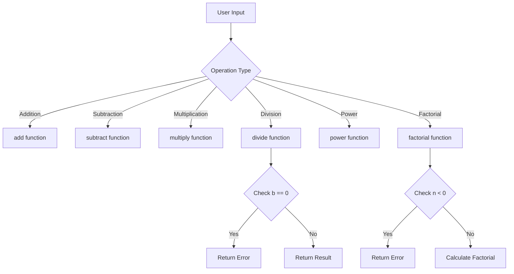

# Calculator Application - Documentation & Testing Suite Implementation Plan

## Project Overview
A Python calculator application with basic arithmetic operations (add, subtract, multiply, divide, power, factorial) that needs professional documentation and comprehensive testing.

## Current State Analysis
- **Single file**: [`calculator.py`](calculator.py:1) with 6 functions
- **No tests**: No existing test coverage
- **No documentation**: No README or API documentation
- **No tooling**: No linting, formatting, or type checking configured
- **Flat structure**: Single file in root directory

## Target Architecture

```
calculator-project/
├── src/
│   └── calculator/
│       ├── __init__.py
│       ├── calculator.py          # Core calculator functions
│       └── py.typed               # PEP 561 marker for type hints
├── tests/
│   ├── __init__.py
│   ├── test_calculator.py         # Unit tests with pytest
│   ├── test_edge_cases.py         # Edge case testing
│   └── conftest.py                # Pytest configuration
├── docs/
│   ├── README.md                  # Main documentation
│   ├── API.md                     # API reference
│   ├── USAGE.md                   # Usage examples
│   ├── ARCHITECTURE.md            # Architecture diagrams
│   └── CONTRIBUTING.md            # Contribution guidelines
├── .github/
│   └── workflows/
│       └── ci.yml                 # GitHub Actions CI/CD
├── .bob/
│   ├── rules-code/
│   │   └── AGENTS.md             # Code mode rules
│   ├── rules-advanced/
│   │   └── AGENTS.md             # Advanced mode rules
│   ├── rules-ask/
│   │   └── AGENTS.md             # Ask mode rules
│   └── rules-plan/
│       └── AGENTS.md             # Plan mode rules
├── AGENTS.md                      # General AI agent guidance
├── .gitignore                     # Git ignore patterns
├── .pre-commit-config.yaml        # Pre-commit hooks
├── pyproject.toml                 # Project configuration
├── setup.py                       # Package setup
├── requirements.txt               # Production dependencies
├── requirements-dev.txt           # Development dependencies
├── .flake8                        # Flake8 configuration
├── mypy.ini                       # MyPy configuration
└── pytest.ini                     # Pytest configuration
```

## Implementation Plan

### Phase 1: Project Structure & Configuration Files

#### 1.1 Create Directory Structure
```bash
mkdir -p src/calculator tests docs .github/workflows .bob/rules-{code,advanced,ask,plan}
```

#### 1.2 Configuration Files to Create

**pyproject.toml** - Central project configuration
- Project metadata (name, version, description, authors)
- Black configuration (line-length: 88, target Python 3.8+)
- isort configuration (profile: black)
- pytest configuration (testpaths, coverage settings)
- Build system configuration (setuptools)

**setup.py** - Package installation
- Package discovery (find_packages)
- Dependencies specification
- Entry points for CLI (optional)
- Classifiers for PyPI

**requirements.txt** - Production dependencies
```
# Empty for now - pure Python stdlib
```

**requirements-dev.txt** - Development dependencies
```
pytest>=7.4.0
pytest-cov>=4.1.0
black>=23.7.0
flake8>=6.1.0
mypy>=1.5.0
pre-commit>=3.3.0
```

**.flake8** - Flake8 linting rules
- max-line-length: 88 (match Black)
- exclude: .git, __pycache__, .venv, build, dist
- ignore: E203, W503 (Black compatibility)

**mypy.ini** - Type checking configuration
- python_version: 3.8
- warn_return_any: True
- warn_unused_configs: True
- disallow_untyped_defs: True

**pytest.ini** - Pytest configuration
- testpaths: tests
- python_files: test_*.py
- python_functions: test_*
- addopts: --cov=src --cov-report=html --cov-report=term-missing

**.pre-commit-config.yaml** - Pre-commit hooks
- black (code formatting)
- flake8 (linting)
- mypy (type checking)
- trailing-whitespace removal
- end-of-file-fixer

**.gitignore** - Git ignore patterns
- Python: __pycache__, *.pyc, *.pyo, .pytest_cache
- Virtual environments: venv/, .venv/, env/
- IDE: .vscode/, .idea/
- Coverage: htmlcov/, .coverage
- Build: dist/, build/, *.egg-info/

#### 1.3 Move and Enhance Calculator Code

**src/calculator/__init__.py**
```python
"""Calculator package for basic arithmetic operations."""
from .calculator import add, subtract, multiply, divide, power, factorial

__version__ = "1.0.0"
__all__ = ["add", "subtract", "multiply", "divide", "power", "factorial"]
```

**src/calculator/calculator.py** - Enhanced with type hints
- Add type hints to all functions
- Add comprehensive docstrings (Google style)
- Improve error handling with custom exceptions
- Add input validation

**src/calculator/py.typed** - Empty marker file for PEP 561

### Phase 2: Comprehensive Test Suite

#### 2.1 Test Structure

**tests/conftest.py** - Pytest fixtures
```python
import pytest
from typing import Callable

@pytest.fixture
def calculator_functions():
    """Provide all calculator functions for testing."""
    from calculator import add, subtract, multiply, divide, power, factorial
    return {
        'add': add,
        'subtract': subtract,
        'multiply': multiply,
        'divide': divide,
        'power': power,
        'factorial': factorial
    }
```

**tests/test_calculator.py** - Core unit tests
- Test each function with normal inputs
- Parametrized tests for multiple input combinations
- Test return types and values
- Test function signatures

Test cases:
```python
# Addition tests
@pytest.mark.parametrize("a,b,expected", [
    (2, 3, 5),
    (-1, 1, 0),
    (0, 0, 0),
    (1.5, 2.5, 4.0),
    (-5, -3, -8)
])

# Subtraction tests
@pytest.mark.parametrize("a,b,expected", [
    (5, 3, 2),
    (0, 5, -5),
    (-3, -2, -1),
    (10.5, 5.5, 5.0)
])

# Multiplication tests
@pytest.mark.parametrize("a,b,expected", [
    (3, 4, 12),
    (0, 100, 0),
    (-2, 5, -10),
    (2.5, 4, 10.0)
])

# Division tests
@pytest.mark.parametrize("a,b,expected", [
    (10, 2, 5.0),
    (7, 2, 3.5),
    (-10, 2, -5.0),
    (0, 5, 0.0)
])

# Power tests
@pytest.mark.parametrize("base,exp,expected", [
    (2, 3, 8),
    (5, 0, 1),
    (10, 2, 100),
    (3, 4, 81)
])

# Factorial tests
@pytest.mark.parametrize("n,expected", [
    (0, 1),
    (1, 1),
    (5, 120),
    (10, 3628800)
])
```

**tests/test_edge_cases.py** - Edge case and error testing
- Division by zero handling
- Negative factorial handling
- Large number handling
- Float precision edge cases
- Type error handling (if validation added)
- Boundary conditions

Test cases:
```python
# Division by zero
def test_divide_by_zero():
    result = divide(10, 0)
    assert "Error" in result or isinstance(result, str)

# Negative factorial
def test_factorial_negative():
    result = factorial(-5)
    assert "Error" in result or isinstance(result, str)

# Large numbers
def test_large_numbers():
    assert factorial(20) == 2432902008176640000
    assert power(2, 20) == 1048576

# Float precision
def test_float_precision():
    result = divide(1, 3)
    assert abs(result - 0.3333333333333333) < 1e-10

# Zero edge cases
def test_zero_operations():
    assert multiply(0, 1000000) == 0
    assert add(0, 0) == 0
    assert power(0, 5) == 0
```

#### 2.2 Test Coverage Goals
- **Target**: 100% code coverage
- **Minimum**: 95% code coverage
- **Branch coverage**: All conditional branches tested
- **Error paths**: All error conditions tested

### Phase 3: Documentation Suite

#### 3.1 Main Documentation Files

**docs/README.md** - Primary documentation
Structure:
1. Project title and badges (build status, coverage, version)
2. Overview and features
3. Installation instructions
4. Quick start guide
5. Basic usage examples
6. API reference link
7. Contributing guidelines link
8. License information

**docs/API.md** - Complete API reference
For each function:
- Function signature with type hints
- Description
- Parameters (name, type, description)
- Return value (type, description)
- Raises (exceptions, conditions)
- Examples (code snippets)
- Notes (special behavior, edge cases)

Example structure:
```markdown
## add(a: float, b: float) -> float

Adds two numbers together.

**Parameters:**
- `a` (float): First number
- `b` (float): Second number

**Returns:**
- float: Sum of a and b

**Examples:**
```python
>>> add(2, 3)
5
>>> add(-1, 1)
0
```
```

**docs/USAGE.md** - Comprehensive usage examples
- Installation and setup
- Basic operations examples
- Advanced usage patterns
- Common use cases
- Integration examples
- Best practices
- Performance considerations

**docs/ARCHITECTURE.md** - Architecture documentation
- System overview diagram (Mermaid)
- Function dependency graph
- Data flow diagrams
- Design decisions
- Error handling strategy
- Future enhancements

Mermaid diagrams:


**docs/CONTRIBUTING.md** - Contribution guidelines
- Code of conduct
- Development setup
- Running tests
- Code style guidelines
- Commit message format
- Pull request process
- Issue reporting

#### 3.2 Root README.md
- Project overview
- Quick installation
- Basic usage example
- Link to full documentation
- Build status badges
- License badge

### Phase 4: Code Quality Tools

#### 4.1 Black (Code Formatting)
Configuration in pyproject.toml:
```toml
[tool.black]
line-length = 88
target-version = ['py38', 'py39', 'py310', 'py311']
include = '\.pyi?$'
```

Usage:
```bash
black src/ tests/
black --check src/ tests/  # Check only
```

#### 4.2 Flake8 (Linting)
Configuration in .flake8:
```ini
[flake8]
max-line-length = 88
extend-ignore = E203, W503
exclude = .git,__pycache__,.venv,build,dist
per-file-ignores =
    __init__.py:F401
```

Usage:
```bash
flake8 src/ tests/
```

#### 4.3 MyPy (Type Checking)
Configuration in mypy.ini:
```ini
[mypy]
python_version = 3.8
warn_return_any = True
warn_unused_configs = True
disallow_untyped_defs = True
disallow_incomplete_defs = True
check_untyped_defs = True
no_implicit_optional = True
warn_redundant_casts = True
warn_unused_ignores = True
warn_no_return = True
```

Usage:
```bash
mypy src/
```

#### 4.4 Pre-commit Hooks
Configuration in .pre-commit-config.yaml:
```yaml
repos:
  - repo: https://github.com/pre-commit/pre-commit-hooks
    rev: v4.4.0
    hooks:
      - id: trailing-whitespace
      - id: end-of-file-fixer
      - id: check-yaml
      - id: check-added-large-files
  
  - repo: https://github.com/psf/black
    rev: 23.7.0
    hooks:
      - id: black
  
  - repo: https://github.com/pycqa/flake8
    rev: 6.1.0
    hooks:
      - id: flake8
  
  - repo: https://github.com/pre-commit/mirrors-mypy
    rev: v1.5.0
    hooks:
      - id: mypy
        additional_dependencies: [types-all]
```

Setup:
```bash
pre-commit install
pre-commit run --all-files  # Test all hooks
```

### Phase 5: CI/CD Pipeline

#### 5.1 GitHub Actions Workflow
File: .github/workflows/ci.yml

Workflow stages:
1. **Lint**: Run flake8 on all Python files
2. **Type Check**: Run mypy for type validation
3. **Format Check**: Verify Black formatting
4. **Test**: Run pytest with coverage
5. **Coverage Report**: Upload to Codecov (optional)

Matrix testing:
- Python versions: 3.8, 3.9, 3.10, 3.11
- OS: ubuntu-latest, windows-latest, macos-latest

Triggers:
- Push to main branch
- Pull requests to main
- Manual workflow dispatch

Example workflow:
```yaml
name: CI

on:
  push:
    branches: [ main ]
  pull_request:
    branches: [ main ]

jobs:
  test:
    runs-on: ${{ matrix.os }}
    strategy:
      matrix:
        os: [ubuntu-latest, windows-latest, macos-latest]
        python-version: ['3.8', '3.9', '3.10', '3.11']
    
    steps:
    - uses: actions/checkout@v3
    - name: Set up Python
      uses: actions/setup-python@v4
      with:
        python-version: ${{ matrix.python-version }}
    - name: Install dependencies
      run: |
        pip install -r requirements-dev.txt
    - name: Lint with flake8
      run: flake8 src/ tests/
    - name: Type check with mypy
      run: mypy src/
    - name: Format check with black
      run: black --check src/ tests/
    - name: Test with pytest
      run: pytest --cov=src --cov-report=xml
    - name: Upload coverage
      uses: codecov/codecov-action@v3
```

### Phase 6: AGENTS.md Files

#### 6.1 Root AGENTS.md
Focus on non-obvious project-specific information:
- Custom error handling pattern (string returns vs exceptions)
- Power function uses iterative approach (not `**` operator)
- Factorial uses iterative approach (not recursive)
- Test files must be in tests/ directory for pytest discovery
- Coverage reports generated in htmlcov/ directory

#### 6.2 Mode-Specific AGENTS.md Files

**.bob/rules-code/AGENTS.md**
- Use type hints for all function signatures
- Error messages must start with "Error: " prefix
- Iterative implementations preferred over recursive
- All functions must have Google-style docstrings
- No access to MCP and Browser tools

**.bob/rules-advanced/AGENTS.md**
- Same as code mode rules
- Access to MCP and Browser tools available

**.bob/rules-ask/AGENTS.md**
- Documentation in docs/ directory, not inline
- API reference in docs/API.md follows specific format
- Architecture diagrams use Mermaid syntax
- Examples use doctest-compatible format

**.bob/rules-plan/AGENTS.md**
- Project uses pytest, not unittest
- Black formatting with 88 character line length
- Pre-commit hooks enforce all quality checks
- CI runs on multiple Python versions and OS platforms

## Implementation Order

### Step 1: Project Structure (Code Mode)
1. Create directory structure
2. Move calculator.py to src/calculator/
3. Create __init__.py files
4. Create py.typed marker

### Step 2: Configuration Files (Code Mode)
1. Create pyproject.toml
2. Create setup.py
3. Create requirements files
4. Create .flake8, mypy.ini, pytest.ini
5. Create .gitignore
6. Create .pre-commit-config.yaml

### Step 3: Enhanced Calculator Code (Code Mode)
1. Add type hints to all functions
2. Add comprehensive docstrings
3. Improve error handling
4. Add input validation

### Step 4: Test Suite (Code Mode)
1. Create tests/conftest.py
2. Create tests/test_calculator.py with parametrized tests
3. Create tests/test_edge_cases.py
4. Run tests and verify 100% coverage

### Step 5: Documentation (Code Mode)
1. Create docs/README.md
2. Create docs/API.md
3. Create docs/USAGE.md
4. Create docs/ARCHITECTURE.md with Mermaid diagrams
5. Create docs/CONTRIBUTING.md
6. Create root README.md

### Step 6: AGENTS.md Files (Plan Mode)
1. Create root AGENTS.md
2. Create .bob/rules-code/AGENTS.md
3. Create .bob/rules-advanced/AGENTS.md
4. Create .bob/rules-ask/AGENTS.md
5. Create .bob/rules-plan/AGENTS.md

### Step 7: CI/CD (Code Mode)
1. Create .github/workflows/ci.yml
2. Test workflow locally (if possible)
3. Commit and verify CI runs

### Step 8: Quality Tools Setup (Code Mode)
1. Install pre-commit hooks
2. Run black on all files
3. Run flake8 and fix issues
4. Run mypy and fix type issues
5. Run all pre-commit hooks

### Step 9: Final Verification (Code Mode)
1. Run full test suite
2. Verify coverage reports
3. Check all documentation links
4. Verify package installation
5. Test pre-commit hooks

## Success Criteria

- ✅ 100% test coverage
- ✅ All tests passing
- ✅ Zero linting errors
- ✅ Zero type checking errors
- ✅ All pre-commit hooks passing
- ✅ CI pipeline green
- ✅ Complete documentation
- ✅ Professional project structure
- ✅ AGENTS.md files created with non-obvious information

## Estimated Timeline

- Phase 1-2: 30 minutes (structure + configs)
- Phase 3: 45 minutes (enhanced code + tests)
- Phase 4: 60 minutes (documentation)
- Phase 5: 20 minutes (AGENTS.md files)
- Phase 6: 30 minutes (CI/CD)
- Phase 7: 15 minutes (quality tools)
- Phase 8: 20 minutes (verification)

**Total**: ~3.5 hours for complete implementation

## Next Steps

Ready to proceed with implementation? I recommend switching to Code mode to execute this plan systematically, starting with Phase 1 (Project Structure).