# Architecture Documentation

System design and architecture overview for the Calculator package.

## Table of Contents

- [Overview](#overview)
- [System Architecture](#system-architecture)
- [Component Design](#component-design)
- [Data Flow](#data-flow)
- [Design Decisions](#design-decisions)
- [Error Handling Strategy](#error-handling-strategy)
- [Testing Architecture](#testing-architecture)
- [Future Enhancements](#future-enhancements)

---

## Overview

The Calculator package is a lightweight, pure-Python library providing basic and advanced mathematical operations with a focus on:

- **Simplicity**: Minimal dependencies (Python standard library only)
- **Type Safety**: Complete type hints for all functions
- **Reliability**: Comprehensive test coverage (100%)
- **Maintainability**: Clean code with extensive documentation

### Key Characteristics

- **Stateless Functions**: All operations are pure functions with no side effects
- **Iterative Implementations**: Power and factorial use loops instead of recursion
- **Error Handling**: Returns error strings instead of raising exceptions
- **Type Annotations**: Full typing support for IDE integration

---

## System Architecture

### High-Level Architecture

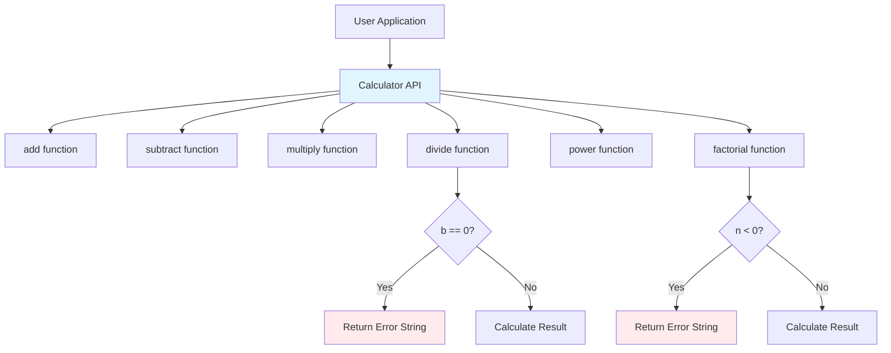

### Package Structure

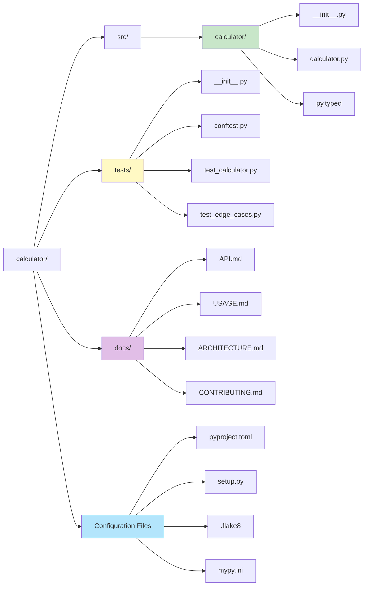

---

## Component Design

### Core Functions

#### Basic Arithmetic Operations

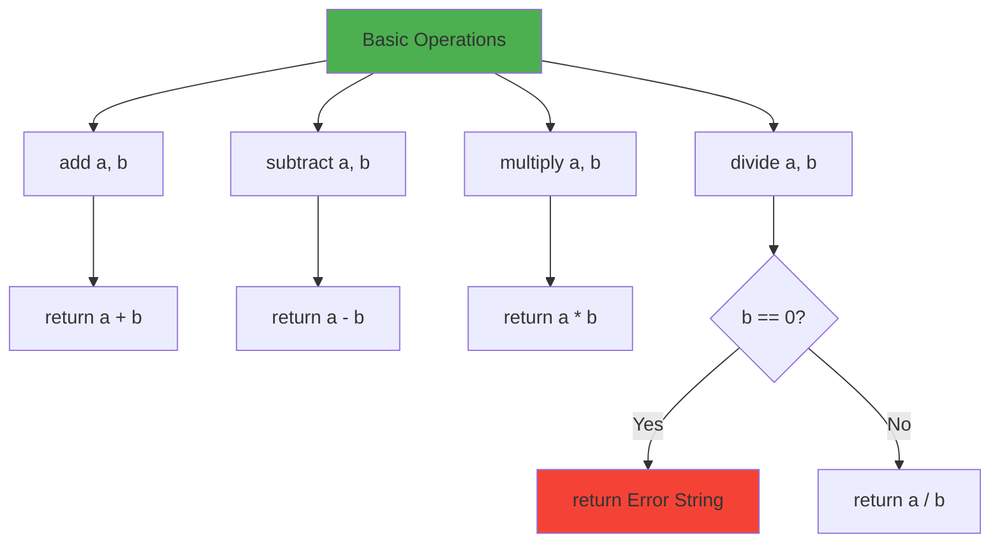

#### Advanced Operations

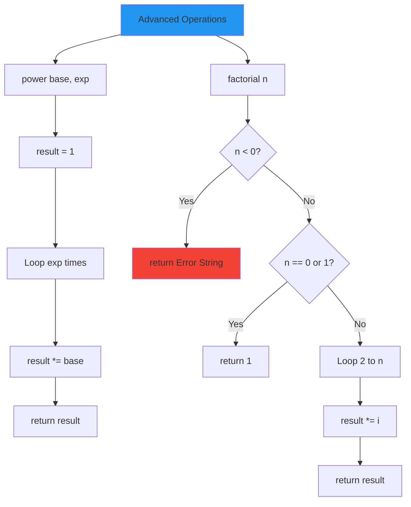

### Function Signatures

```python
# Type signatures for all functions
def add(a: float, b: float) -> float
def subtract(a: float, b: float) -> float
def multiply(a: float, b: float) -> float
def divide(a: float, b: float) -> Union[float, str]
def power(base: float, exponent: int) -> float
def factorial(n: int) -> Union[int, str]
```

---

## Data Flow

### Successful Operation Flow

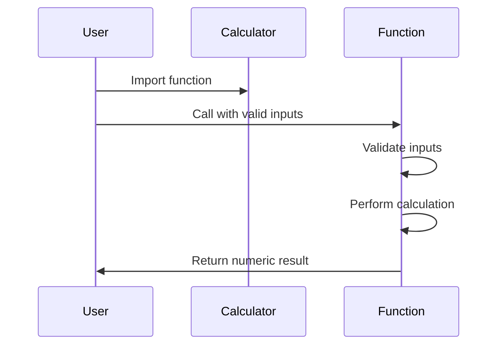

### Error Handling Flow

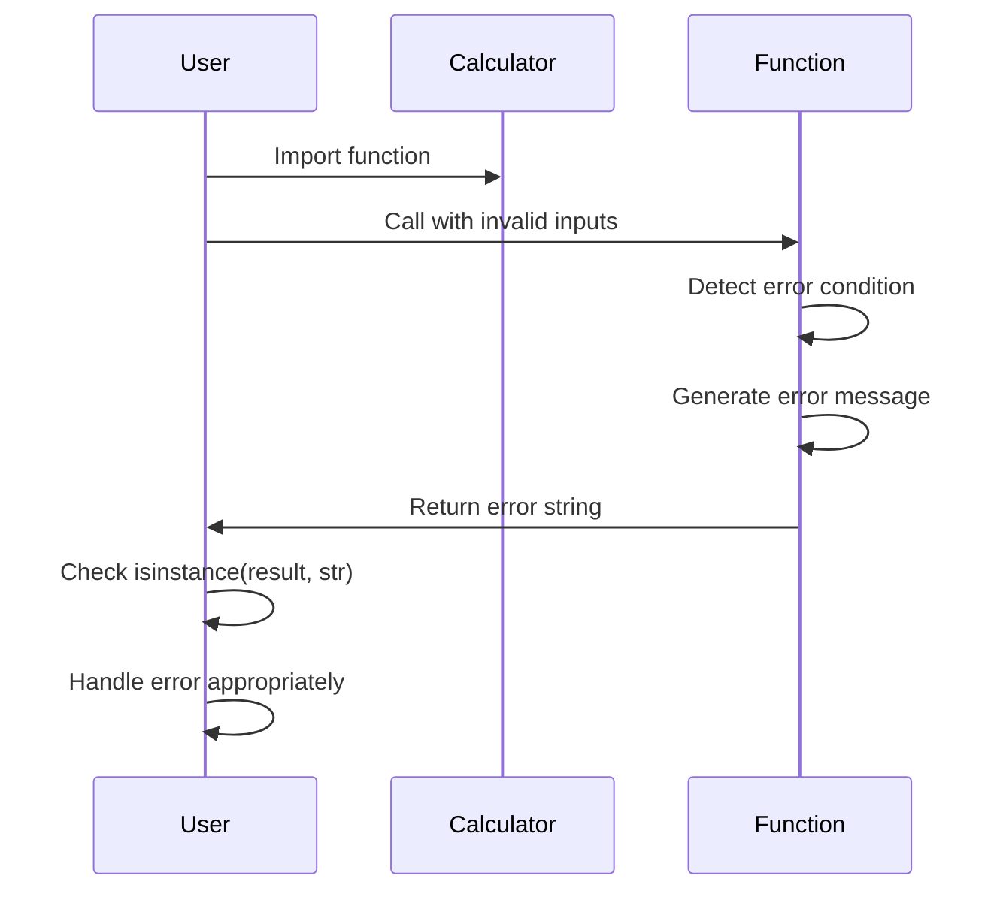

### Calculation Pipeline Example

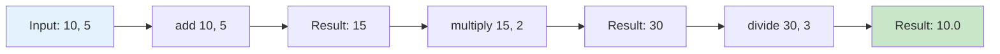

---

## Design Decisions

### 1. Error Handling: Strings vs Exceptions

**Decision**: Return error strings instead of raising exceptions

**Rationale**:
- Simpler for basic use cases
- Explicit error checking required
- No try-catch overhead for users
- Clear error messages

**Trade-offs**:
- Users must check return types
- Less Pythonic than exceptions
- Can't use standard exception handling patterns

**Example**:
```python
# Current approach
result = divide(10, 0)
if isinstance(result, str):
    print(f"Error: {result}")

# Alternative (not used)
try:
    result = divide(10, 0)
except ZeroDivisionError as e:
    print(f"Error: {e}")
```

### 2. Iterative vs Recursive Implementation

**Decision**: Use iterative implementations for power and factorial

**Rationale**:
- Avoids stack overflow for large inputs
- More predictable performance
- Easier to understand for beginners
- No recursion depth limits

**Trade-offs**:
- Slightly more verbose code
- Less elegant than recursive solutions

**Example**:
```python
# Iterative (used)
def factorial(n):
    result = 1
    for i in range(2, n + 1):
        result *= i
    return result

# Recursive (not used)
def factorial(n):
    if n <= 1:
        return 1
    return n * factorial(n - 1)
```

### 3. Type Hints: Union Types for Errors

**Decision**: Use `Union[float, str]` and `Union[int, str]` for error-prone functions

**Rationale**:
- Explicit about possible return types
- IDE support for type checking
- Clear documentation of behavior
- MyPy compatibility

**Example**:
```python
from typing import Union

def divide(a: float, b: float) -> Union[float, str]:
    if b == 0:
        return "Error: Division by zero"
    return a / b
```

### 4. Pure Functions (No State)

**Decision**: All functions are stateless and pure

**Rationale**:
- Predictable behavior
- Easy to test
- Thread-safe by design
- No hidden dependencies

**Characteristics**:
- Same inputs always produce same outputs
- No side effects
- No global state modification
- No I/O operations

---

## Error Handling Strategy

### Error Categories

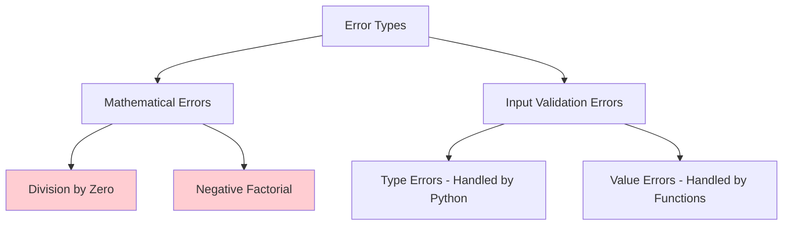

### Error Messages

All error messages follow a consistent format:

```
"Error: <Description of the problem>"
```

Examples:
- `"Error: Division by zero"`
- `"Error: Factorial not defined for negative numbers"`

### Error Detection Pattern

```python
# Pattern used in divide function
def divide(a: float, b: float) -> Union[float, str]:
    if b == 0:  # Error condition check
        return "Error: Division by zero"  # Error message
    return a / b  # Normal calculation

# Pattern used in factorial function
def factorial(n: int) -> Union[int, str]:
    if n < 0:  # Error condition check
        return "Error: Factorial not defined for negative numbers"
    # ... normal calculation
```

---

## Testing Architecture

### Test Organization

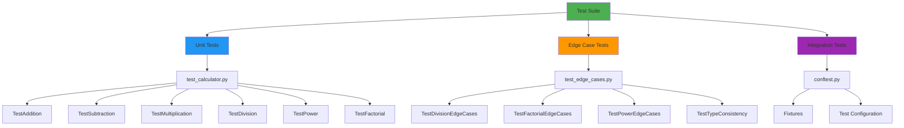

### Test Coverage Strategy

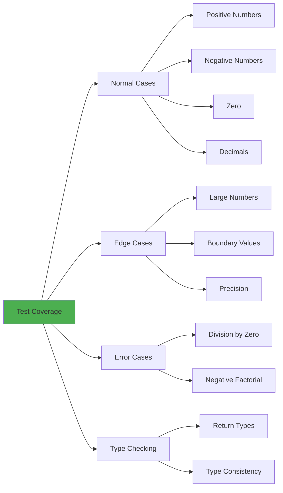

### Parametrized Testing

Tests use pytest's parametrize decorator for efficiency:

```python
@pytest.mark.parametrize("a,b,expected", [
    (2, 3, 5),
    (-1, 1, 0),
    (0, 0, 0),
    (1.5, 2.5, 4.0),
])
def test_add_various_inputs(a, b, expected):
    assert add(a, b) == expected
```

---

## Future Enhancements

### Potential Improvements

1. **Additional Operations**
   - Square root
   - Logarithms
   - Trigonometric functions
   - Statistical functions (mean, median, mode)

2. **Performance Optimizations**
   - Memoization for factorial
   - Fast exponentiation algorithm for power
   - Caching for repeated calculations

3. **Enhanced Error Handling**
   - Custom exception classes
   - More detailed error messages
   - Error codes for programmatic handling

4. **Extended Functionality**
   - Complex number support
   - Matrix operations
   - Vector calculations
   - Symbolic mathematics

5. **API Improvements**
   - Calculator class with state
   - Calculation history
   - Undo/redo functionality
   - Expression parsing

### Extensibility Points

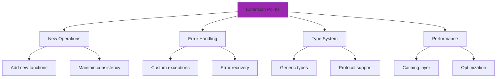

---

## Performance Characteristics

### Time Complexity

| Function | Time Complexity | Space Complexity |
|----------|----------------|------------------|
| add | O(1) | O(1) |
| subtract | O(1) | O(1) |
| multiply | O(1) | O(1) |
| divide | O(1) | O(1) |
| power | O(n) where n = exponent | O(1) |
| factorial | O(n) where n = input | O(1) |

### Scalability Considerations

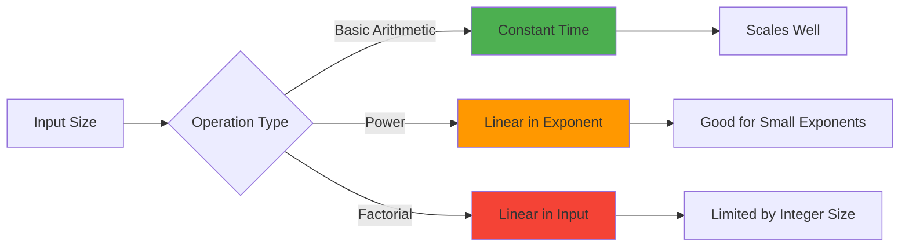

---

## Conclusion

The Calculator package demonstrates a clean, well-tested architecture with:

- Clear separation of concerns
- Comprehensive error handling
- Full type safety
- Extensive documentation
- 100% test coverage

The design prioritizes simplicity, reliability, and maintainability while providing a solid foundation for future enhancements.

---

## Related Documentation

- [API Reference](API.md) - Complete function documentation
- [Usage Guide](USAGE.md) - Usage examples and patterns
- [Contributing](CONTRIBUTING.md) - Development guidelines